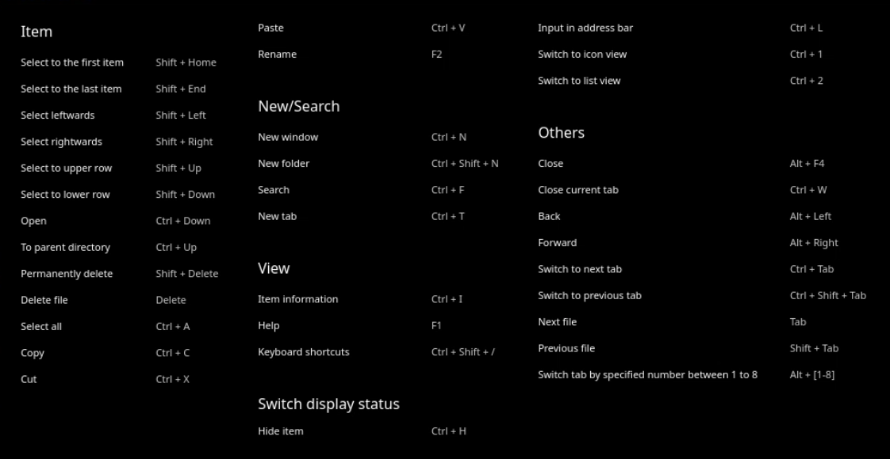
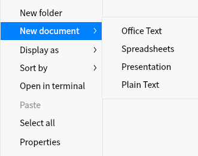
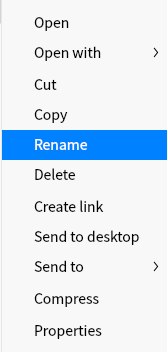

# dde-file-manager

## Description
dde-file-manager is a powerful, easy-to-use file management tool. It follows the classic functions and layouts of traditional file managers, and on this basis simplifies user operations and adds many special functions. The clear navigation bar, intelligently recognized search box, diverse views and sorting make it easy for you to manage, classic and beyond, just to give you a better experience!

## Software Architecture
Software architecture description

## Installation

```shell
dnf install dde-file-manager
```

## Instructions

### Run dde-file-manager

1. Click the launcher icon on the dock to enter the launcher interface.
2. Scroll the mouse wheel up or down to browse or search for the dde-file-manager icon , and click Run.
3. By right-clicking the dde-file-manager icon, you can:
   - Click **Send to Desktop** to create a shortcut on the desktop.
   - Click **Send to dock** to pin the app to the dock.
   - Click **Add to startup** to add the application to the startup items to automatically run the application when the computer is turned on.

> TIP: You can also use the shortcut **Super + E** to launch the dde-file-manager.

### Close the dde-file-manager

- In the dde-file-manager interface, click X to exit the dde-file-manager.
- Right-click the dde-file-manager icon on the taskbar and select **Close All** to exit the dde-file-manager.
- On the dde-file-manager interface, click the menu bar and select Exit to exit the dde-file-manager.

### View shortcut keys

In the dde-file-manager interface, use the shortcut keys **Ctrl + Shift + /** to open the shortcut key preview interface. Skilled use of shortcut keys will greatly improve your operational efficiency.



## Basic Skills

The dde-file-manager has basic file management functions, and it is very simple to create, copy, rename, and delete files (folders).

### Create a new file

#### New document

1. In a blank area of the file manager, right-click.
2. Select **New Document**.
3. Select the type of new file from the drop-down menu.
4. Enter a name for the new file.



#### New folder

1. In a blank area of the file manager, right-click.
2. Select **New Folder**.
3. Enter a name for the new folder.

### Rename file

1. In the file manager interface, right-click the file.
2. Select **Rename**.
3. Enter the file name and press **Enter** or click in the blank area of the interface.



> Tip: Check "Hide file extension when rename" in **Settings**, it can be more convenient to modify the file name

## Contribution

1.  Fork the repository
2.  Create Feat_xxx branch
3.  Commit your code
4.  Create Pull Request


## Gitee Feature

1.  You can use Readme\_XXX.md to support different languages, such as Readme\_en.md, Readme\_zh.md
2.  Gitee blog [blog.gitee.com](https://blog.gitee.com)
3.  Explore open source project [https://gitee.com/explore](https://gitee.com/explore)
4.  The most valuable open source project [GVP](https://gitee.com/gvp)
5.  The manual of Gitee [https://gitee.com/help](https://gitee.com/help)
6.  The most popular members  [https://gitee.com/gitee-stars/](https://gitee.com/gitee-stars/)
