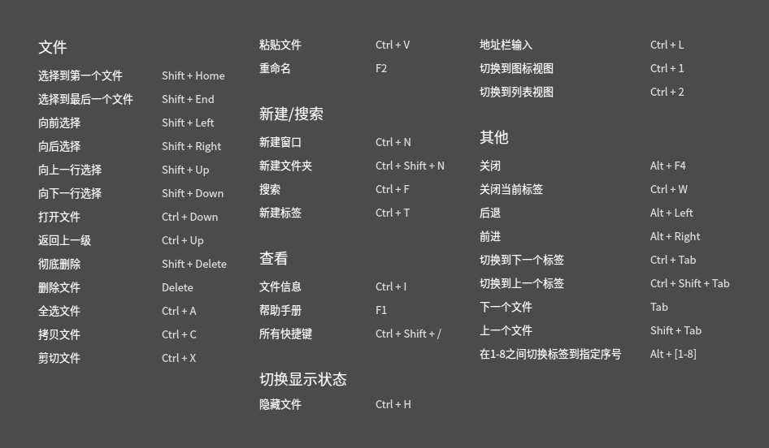
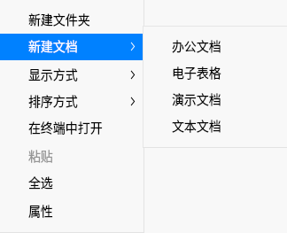
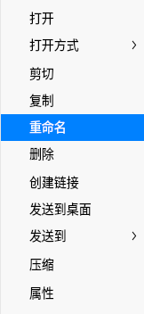

# dde-file-manager

## 介绍
文件管理器是一款功能强大、简单易用的文件管理工具。它沿用了传统文件管理器的经典功能和布局，并在此基础上简化了用户操作，增加了很多特色功能。一目了然的导航栏、智能识别的搜索框、多样化的视图及排序让您管理起来得心应手，经典和超越，只为给您更好的体验！

## 软件架构
软件架构说明


## 安装教程

```shell
dnf install dde-file-manager
```

## 使用说明

### 运行文件管理器

1. 单击任务栏上的启动器图标，进入启动器界面。
2. 上下滚动鼠标滚轮浏览或通过搜索，找到文件管理器图标 ，单击运行。
3. 右键单击文件管理器图标，您可以：
   - 单击 **发送到桌面**，在桌面创建快捷方式。
   - 单击 **发送到任务栏**，将应用程序固定到任务栏。
   - 单击 **开机自动启动**，将应用程序添加到开机启动项，在电脑开机时自动运行该应用。

> 窍门：您也可以使用快捷键 **Super + E** 启动文件管理器。

### 关闭文件管理器

- 在文件管理器界面，单击 X，退出文件管理器。
- 在任务栏右键单击文件管理器图标，选择 **关闭所有** ，退出文件管理器。
- 在文件管理器界面，单击菜单栏，选择退出，退出文件管理器。

### 查看快捷键

在文件管理器界面，使用快捷键 **Ctrl + Shift + /** 打开快捷键预览界面。熟练地使用快捷键，将大大提升您的操作效率。



## 基本功能

文件管理器具备基本的文件管理功能，对文件（夹）进行新建、复制、重命名、删除等操作都非常简单。

### 新建文件

#### 新建文档

1. 在文件管理器空白区域，单击鼠标右键。
2. 选择 **新建文档**。
3. 在下拉菜单中选择新建文件的类型。
4. 输入新建文件的名称。



#### 新建文件夹

1. 在文件管理器空白区域，单击鼠标右键。
2. 选择 **新建文件夹**。
3. 输入新建文件夹的名称。

### 重命名文件

1. 在文件管理器界面，右键单击文件。
2. 选择 **重命名**。
3. 输入文件名称，按 **Enter** 键或者单击界面空白区域。



> 窍门：在 **设置** 中勾选“重命名时隐藏文件扩展名”，能更方便地修改文件名称

## 参与贡献

1.  Fork 本仓库
2.  新建 Feat_xxx 分支
3.  提交代码
4.  新建 Pull Request


## 码云特技

1.  使用 Readme\_XXX.md 来支持不同的语言，例如 Readme\_en.md, Readme\_zh.md
2.  码云官方博客 [blog.gitee.com](https://blog.gitee.com)
3.  你可以 [https://gitee.com/explore](https://gitee.com/explore) 这个地址来了解码云上的优秀开源项目
4.  [GVP](https://gitee.com/gvp) 全称是码云最有价值开源项目，是码云综合评定出的优秀开源项目
5.  码云官方提供的使用手册 [https://gitee.com/help](https://gitee.com/help)
6.  码云封面人物是一档用来展示码云会员风采的栏目 [https://gitee.com/gitee-stars/](https://gitee.com/gitee-stars/)
